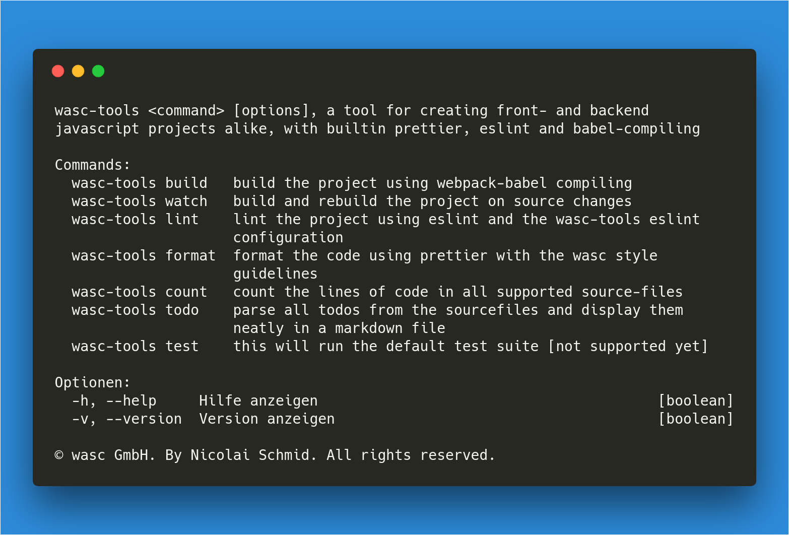

# \wasc-tools\
# [](https://github.com/wasc-io/tools)
Opinionated toolkit for every JavaScript project in need 🚨

# Installation
Install in your project:

```
yarn add -D @wasc/tools
```

## Usage
This tools provides most of the required tools for a big JS project. It transpiles with, it lints, it pretties, it tests and it even counts lines of code. All behind an easy cli.
For big projects we recommend to use the tool inside the package.json's scripts-tag:

```json
"scripts": {
    "start": "wasc-tools watch",
    "build": "wasc-tools build",
    "lint": "wasc-tools lint",
    "format": "wasc-tools format",
    "test": "wasc-tools test",
    "count": "wasc-tools count",
    "todo": "wasc-tools todo",
}
```

## Usage with IDE tooling
The project exports a `prettier.js` and `eslint.js` file with the accepted configurations. In your project just add an `.eslintrc.js` file:
```javascript
module.exports = require('@wasc/tools/eslint');
```
and a `prettier.config.js`:
```javascript
module.exports = require('@wasc/tools/prettier');
```

## [Changelog](CHANGELOG.md)